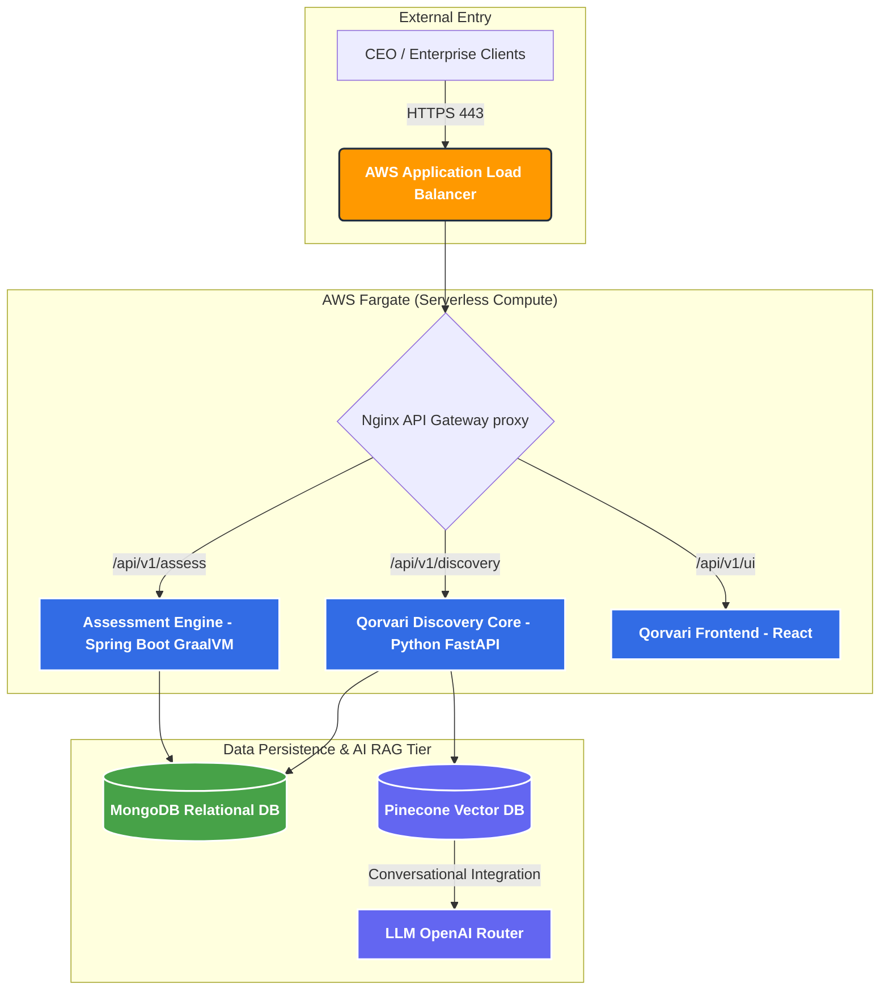

# High-Level Architecture (C4 Model)
**Architect:** `@Agent-ChiefArchitect`

This document defines the physical hardware boundaries and microservice layers required to launch Qorvari into production on a serverless AWS infrastructure. By shedding the legacy monolithic EC2 allocations, the SaaS operates on a 100% elastic finOps model—costing almost $0 when inactive.

