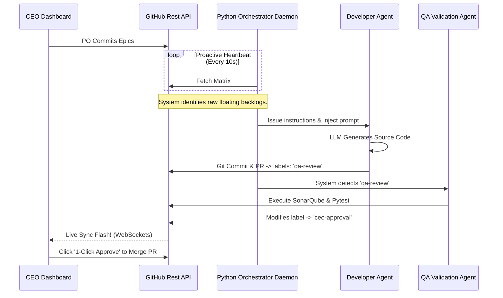

# Agent Swarm Execution Matrix
**Architect:** `@Agent-ChiefArchitect`

The core IP of the Qorvari platform is not just discovery software, but the **Autonomous Company Matrix**. The company consists of zero human employees beyond the CEO. Code is generated, tested, audited, and deployed entirely by algorithmic loops.

## V3 Orchestrator Sequence Flow

