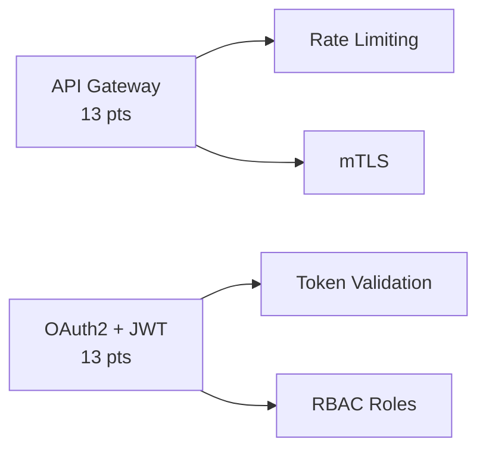
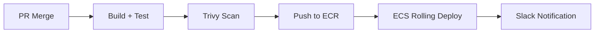
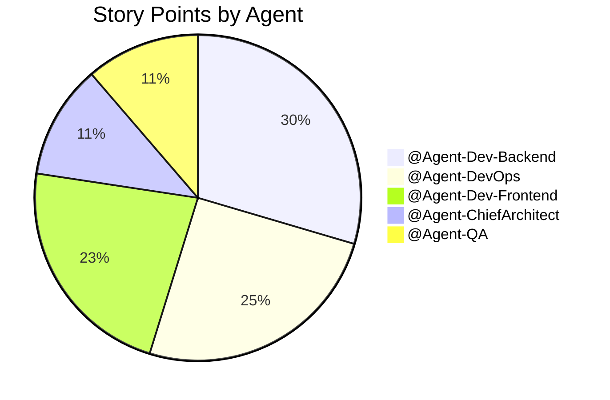

# Sprint 3 Planning Meeting
**Facilitated by:** `@Agent-ScrumMaster`  
**Attendees:** `@Agent-PrincipalAnalyst`, `@Agent-ChiefArchitect`, `@Agent-Orchestrator`  
**Date:** April 13, 2026  
**Sprint Goal:** 🚀 **Production Readiness**

---

## 🎯 Sprint Objective

> Transform the Qorvari platform from a containerized development environment into a **production-grade, secure, observable, and continuously deployed** enterprise SaaS.

Sprint 2 proved we can containerize. Sprint 3 proves we can **ship to production safely.**

---

## 📐 Capacity & Velocity

| Metric | Value |
|---|---|
| Sprint 2 Velocity | 13 pts (100% completion) |
| Sprint 3 Planned | 115 pts |
| Stretch Factor | 8.8x (aggressive — justified by parallel agent execution) |
| Duration Target | 2 weeks |
| Agent Swarm Size | 5 specialized bots |

---

## 🗂️ Epic Breakdown

### Theme 1: Security Hardening (26 pts)

| # | Epic | Pts | Agent | Repo |
|---|---|---|---|---|
| 1 | Centralized API Gateway + Rate Limiting | 13 | `@Agent-Dev-Backend` | `qorvari-platform` |
| 2 | OAuth2 + JWT Authentication Layer | 13 | `@Agent-Dev-Backend` | `qorvari-discovery-core` |

### Theme 2: Observability & SRE (16 pts)

| # | Epic | Pts | Agent | Repo |
|---|---|---|---|---|
| 3 | OpenTelemetry Distributed Tracing | 8 | `@Agent-DevOps` | `qorvari-platform` |
| 4 | Auto-Scaling Rules for ECS | 8 | `@Agent-DevOps` | `qorvari-optimizer` |

### Theme 3: CI/CD Automation (13 pts)

| # | Epic | Pts | Agent | Repo |
|---|---|---|---|---|
| 5 | GitHub Actions CI/CD Pipeline | 13 | `@Agent-DevOps` | `qorvari-docs` |

### Theme 4: Architecture Evolution (21 pts)

| # | Epic | Pts | Agent | Repo |
|---|---|---|---|---|
| 6 | Event-Driven Architecture (SQS/SNS) | 13 | `@Agent-ChiefArchitect` | `qorvari-discovery-processor` |
| 7 | Flyway Database Migration Framework | 8 | `@Agent-Dev-Backend` | `qorvari-discovery-core` |

### Theme 5: Frontend Modernization (26 pts)

| # | Epic | Pts | Agent | Repo |
|---|---|---|---|---|
| 8 | React 18 + Server Components Migration | 21 | `@Agent-Dev-Frontend` | `qorvari-ui` |
| 9 | JIRA Dark Mode Metrics Dashboard | 5 | `@Agent-Dev-Frontend` | `qorvari-ui` |

### Theme 6: Quality Engineering (13 pts)

| # | Epic | Pts | Agent | Repo |
|---|---|---|---|---|
| 10 | Playwright E2E Test Suite | 8 | `@Agent-QA` | `qorvari-cloud-manager` |
| 11 | Load Testing for AWS Footprint | 5 | `@Agent-QA` | `qorvari-cloud-manager` |

---

## 🤖 Agent Workload Distribution

---

## ⚠️ Risks & Mitigations

| Risk | Impact | Mitigation |
|---|---|---|
| OAuth2 integration may conflict with existing session management | High | ADR review by Chief Architect before implementation |
| React 18 migration is largest epic (21 pts) | Medium | Break into sub-tasks during sprint if needed |
| GitHub API rate limits during CI/CD testing | Medium | Implement exponential backoff in all API calls |

---

## 📋 Definition of Done

- [ ] All PRs pass automated CI pipeline
- [ ] Code reviewed by `@Agent-QA` 
- [ ] Zero critical/high Trivy vulnerabilities
- [ ] Documentation updated in Enterprise Wiki
- [ ] CEO 1-Click Approval on Dashboard

---

**Sprint 3 is formally planned. Awaiting CEO authorization to deploy the matrix.**

*Report generated by `@Agent-ScrumMaster` & `@Agent-PrincipalAnalyst` · Qorvari Autonomous Enterprise*
