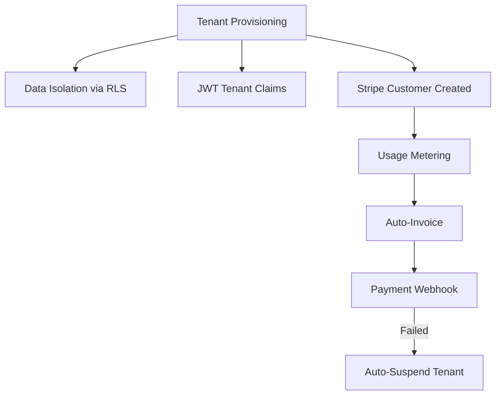
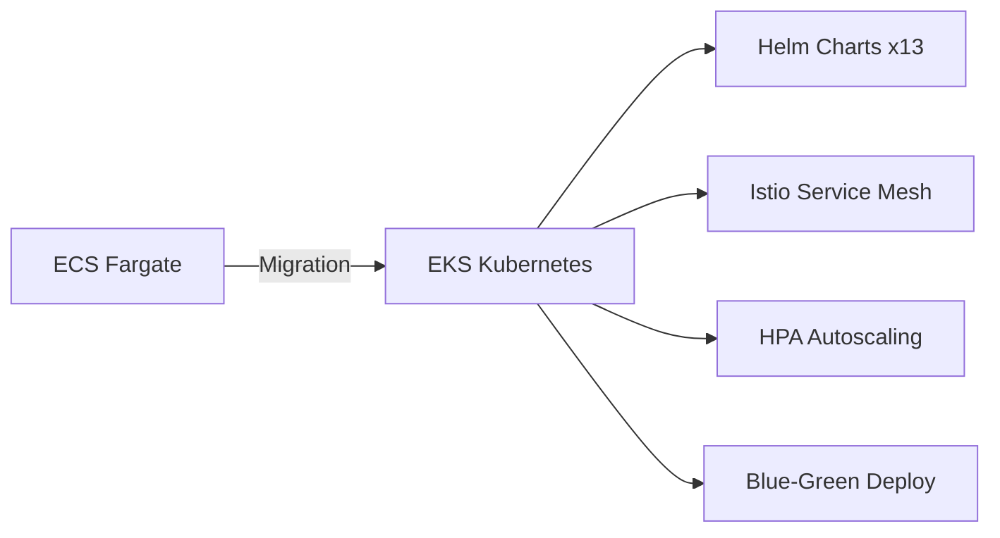
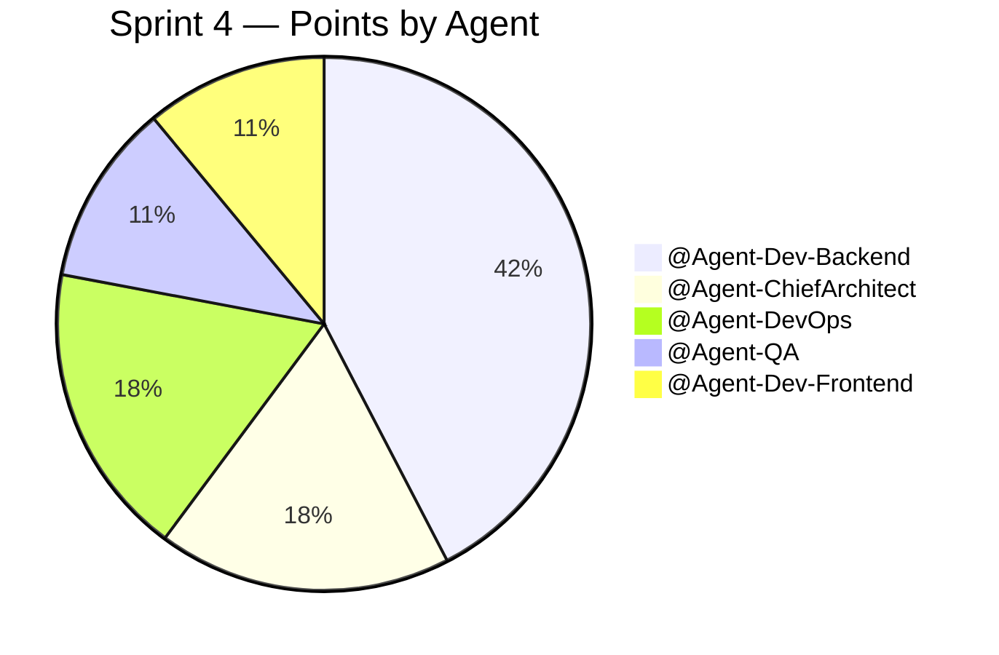

# Sprint 4 Planning Meeting
**Facilitated by:** `@Agent-ScrumMaster`  
**Attendees:** `@Agent-PrincipalAnalyst`, `@Agent-ChiefArchitect`, `@Agent-Orchestrator`  
**Date:** April 13, 2026  
**Sprint Goal:** 💰 **Scale & Monetization**

---

## 🎯 Sprint Objective

> Transform Qorvari from a single-instance platform into a **multi-tenant, revenue-generating SaaS** with Kubernetes orchestration, AI-powered analytics, and enterprise billing.

Sprint 3 makes us production-ready. Sprint 4 makes us **commercially viable.**

---

## 📐 Capacity & Velocity

| Metric | Value |
|---|---|
| Sprint 3 Planned | 115 pts |
| Sprint 4 Planned | 118 pts |
| Duration Target | 2 weeks |
| Agent Swarm Size | 5 specialized bots |

---

## 🗂️ Epic Breakdown

### Theme 1: Multi-Tenancy & Revenue (42 pts)

| # | Epic | Pts | Agent | Repo |
|---|---|---|---|---|
| 1 | Multi-Tenant Architecture (Data Isolation) | 21 | `@Agent-ChiefArchitect` | `qorvari-platform` |
| 2 | Stripe Billing + Usage Metering | 21 | `@Agent-Dev-Backend` | `qorvari-platform` |

### Theme 2: Infrastructure Evolution (21 pts)

| # | Epic | Pts | Agent | Repo |
|---|---|---|---|---|
| 3 | ECS → Kubernetes EKS Migration | 21 | `@Agent-DevOps` | `qorvari-cloud-manager` |

### Theme 3: AI/ML Intelligence (21 pts)

| # | Epic | Pts | Agent | Repo |
|---|---|---|---|---|
| 4 | LLM RAG Pipeline for Discovery Analysis | 21 | `@Agent-Dev-Backend` | `qorvari-discovery-core` |

### Theme 4: Enterprise UX (13 pts)

| # | Epic | Pts | Agent | Repo |
|---|---|---|---|---|
| 5 | Admin Portal (Tenant + Billing Management) | 13 | `@Agent-Dev-Frontend` | `qorvari-ui` |

### Theme 5: Reliability & DX (21 pts)

| # | Epic | Pts | Agent | Repo |
|---|---|---|---|---|
| 6 | Chaos Engineering Suite | 13 | `@Agent-QA` | `qorvari-cloud-manager` |
| 7 | OpenAPI 3.0 + Swagger Developer Portal | 8 | `@Agent-Dev-Backend` | `qorvari-docs` |

---

## 🤖 Agent Workload Distribution

---

## 💰 Revenue Impact

| Milestone | Business Value |
|---|---|
| Multi-tenancy live | Can onboard first paying customer |
| Stripe billing active | Automated MRR collection |
| AI analysis feature | Premium tier differentiator ($99/mo add-on) |
| Swagger portal | Reduces sales cycle (self-service integration) |

---

**Sprint 4 is formally planned. Tickets are in the Backlog with `sprint-planning` labels, protected until Sprint 3 completes.**

*Report generated by `@Agent-PrincipalAnalyst` · Qorvari Autonomous Enterprise*
